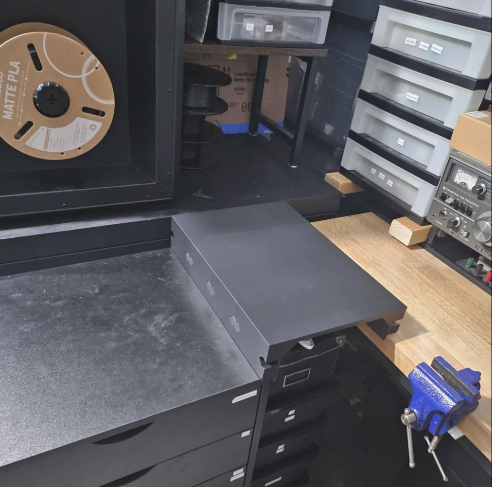

# Desk Extender

A simple desk extender to fill the gap between furniture.

## Measurements

Fill in all measurements in inches. Decimal or fractional inches are both fine;
use one format consistently where practical. **Front** means the side where I
stand; **back** means the AS/400 side.

The old taped-together prototype shows the intended idea: one or more printed
profiles raise the lower furniture surfaces to the height of the AS/400 and
support a flat, mechanically joined top.

### Known dimensions

- Finished surface / AS/400 height: 35 in
- Chest of drawers height: 32 in
- Required rise above chest of drawers: 3 in
- Electronics desk height: 32.75 in
- Required rise above electronics desk: 2.25 in
- Electronics desk top thickness: 1.5 in
- Measured gap between chest of drawers and electronics desk: 9 in
- Expected use: light items and a cat weighing about 5 lb

### Dimensions still needed

#### Top-view footprint

- Finished extender width, left-to-right: 11 in (9 in gap + 1 in + 1 in overlaps)
- Extender depth, from the front edge of the chest of drawers to the front face of the AS/400: 16 in
- Gap between the extender's back edge and the AS/400: 0 in (snug fit)
- Gap from the chest of drawers to the electronics desk at the front: 9 in
- Gap from the chest of drawers to the electronics desk at the back: 9 in
- Amount the extender may overlap/rest on the chest of drawers: 1 in
- Amount the extender may overlap/rest on the electronics desk: 1 in
- Notch needed around the AS/400 or desk frame: no

#### Support profile

- Vertical thickness of the horizontal bridge spanning the furniture gap: 3/8 in
- Clear-space measurement: 1.25 in vertically
- The 1.25 in is assumed to run from the top of the containers to the underside of the bridge
- Obstructions in either overlap area: none

#### Side-to-side retention

- A 1/2 in deep locating lip hangs just inside each furniture edge
- Each lip is 1/8 in thick and merges directly into its upper support
- The paired lips limit side-to-side movement while the 1 in overlaps carry the load
- Front-to-back retention is intentionally postponed

#### Corner reinforcement

- Two continuous triangular ribs reinforce each chunk, one along either side
- Each rib has 1 x 1 in legs and runs through the full 4 in chunk depth
- The 45-degree faces print without support

#### Fit and retention

- Retention: allow it to rest on both tops; postpone any anti-slide feature unless testing shows one is needed
- Acceptable removable hardware (printed pins, bolts/nuts, screws, threaded inserts): Any
- Containers below must remain removable while the extender is installed: yes

### 3D printer and material

- Printer model: Original Prusa CORE One L
- Maximum print volume (X x Y x Z): 11.8 x 11.8 x 13 in
- Nozzle diameter: 0.0157 in (0.4 mm, factory-installed high-flow nozzle)
- Available/preferred filament (PLA, PETG, ABS/ASA, etc.): PLA
- Largest practical print duration per part: any hours
- Is printing multiple mechanically joined sections acceptable? yes

## OpenSCAD model

The extender is modeled in [`desk_extender.scad`](desk_extender.scad) as four
identical 4 in deep chunks. Each chunk independently spans the 9 in furniture
gap and rests 1 in on the chest of drawers and 1 in on the electronics desk.
The assembled size is 11 x 16 in, with a finished height matching the AS/400.

Two removable printed bow-tie keys lock each seam. The widened ends resist the
chunks pulling apart, and no glue or metal hardware is required. To use the
model, change the `part` variable near the top of the file:

The buried end of each slot tapers to a point so it closes gradually during
printing rather than creating an unsupported ceiling. Keep the exported chunk
orientation and print it without supports.

Every chunk also includes two downward locating lips. They sit inside the chest
and desk edges to prevent a sideways nudge from moving either 1 in overlap off
its supporting surface.

- `part = "assembled"` previews the complete extender.
- `part = "chunk"` produces one print-oriented chunk; print four copies.
- `part = "keys"` produces all 6 keys required for four chunks.
- `part = "fit_test"` produces a small slotted coupon and one key.

Change `chunk_count` to preview a longer or shorter extender in 4 in increments.
The chunk is deliberately exported standing on a front/back cross-section so
the printer does not have to bridge the 9 in gap in midair.

Print the `fit_test` first. Adjust `key_side_clearance` or
`key_thickness_clearance` if the fit is too tight or loose for the printer and
PLA, then export the full chunk and key sets.
