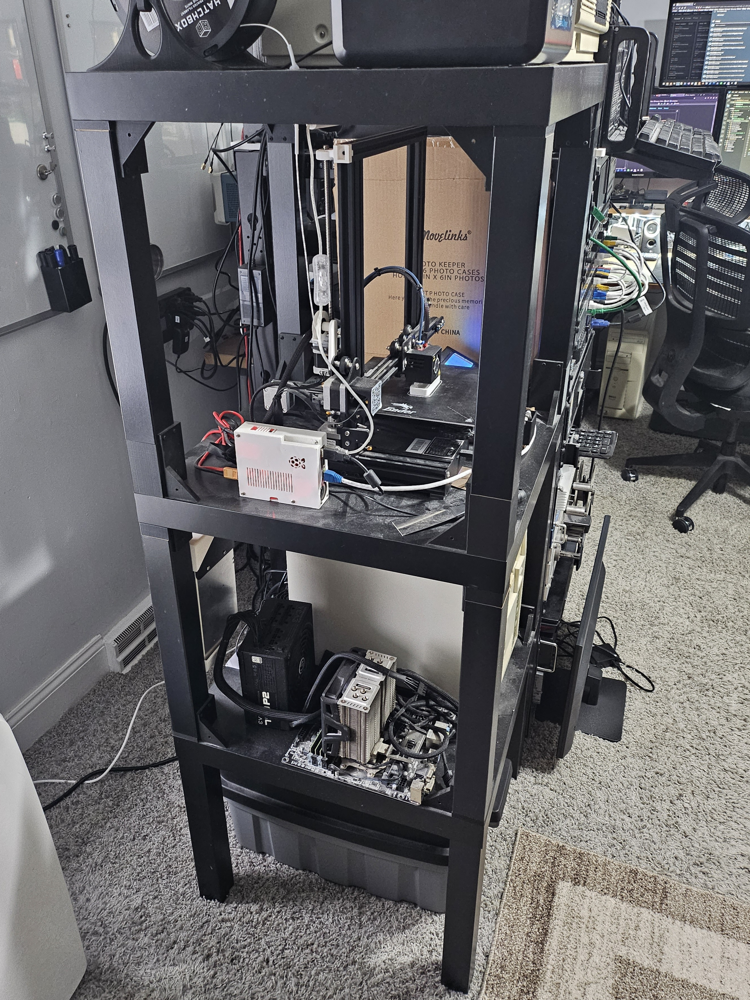
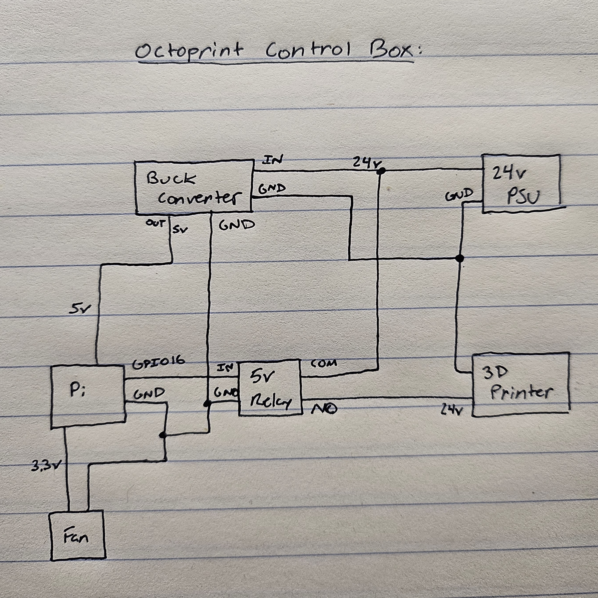

# ender3-octoprint

My Ender 3 Octoprint setup.

I made this too long ago and unfortunately didn't document anything.

## Block Diagram

## Octoprint

I also set this up a while ago without documenting...

https://octoprint.org/download/

Plugins:

- PSU Control
  - General > GPIO Device = `/dev/gpiochip0`
  - Switching > Switching Method = GPIO, On/Off GPIO Pin = 16
- PSU Control - RPi.GPIO
  - General > GPIO Mode = BOARD
  - Switching > Pin = 16
  - Sensing > Pin = 0

After installing latest Octoprint (1.11.2), I had to install plugin to resolve SD card firmware issues.
Rather than reinstalling my Ender 3's firmware (I'm lazy and hoping I can get a new 3D printer soon), I'm going to do a workaround:
- https://community.octoprint.org/t/octoprint-shows-my-printers-sd-card-as-uninitialized-on-my-creality-printer/35284
- plugin: https://gist.github.com/foosel/9ca02e8a3ea0cb748f4b220981eab12d/raw/convert_TF_SD.py

## Lack Enclosure

I used someone's 3D prints to attempt to make a 3 level Ikea lack tower.
I never managed to get plexiglass to finish the enclosure, but its been so long I'm going to keep it as is.
