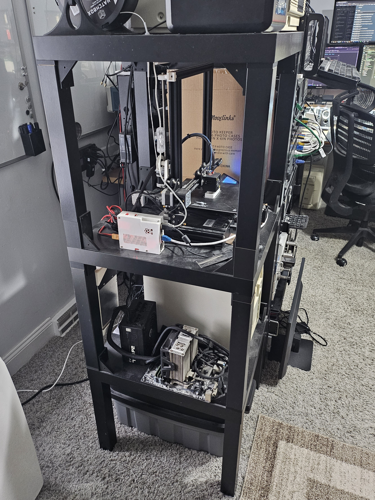
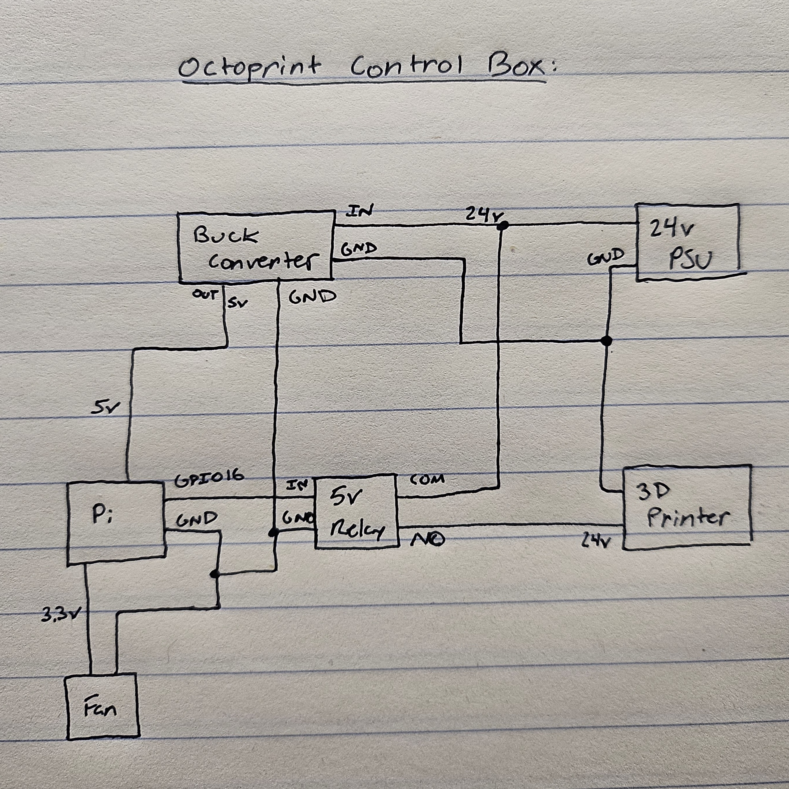

# ender3

My Ender 3 setup with Octoprint and remote power toggle.

I made this too long ago and unfortunately didn't document anything.

## Block Diagram

## Octoprint

I also set this up a while ago without documenting...

https://octoprint.org/download/

Plugins:

- PSU Control
  - General > GPIO Device = `/dev/gpiochip0`
  - Switching > Switching Method = GPIO, On/Off GPIO Pin = 16
- PSU Control - RPi.GPIO
  - General > GPIO Mode = BOARD
  - Switching > Pin = 16
  - Sensing > Pin = 0

## Lack Enclosure

I used someone's 3D prints to attempt to make a 3 level Ikea lack tower.
I never managed to get plexiglass to finish the enclosure, but its been so long I'm going to keep it as is.
