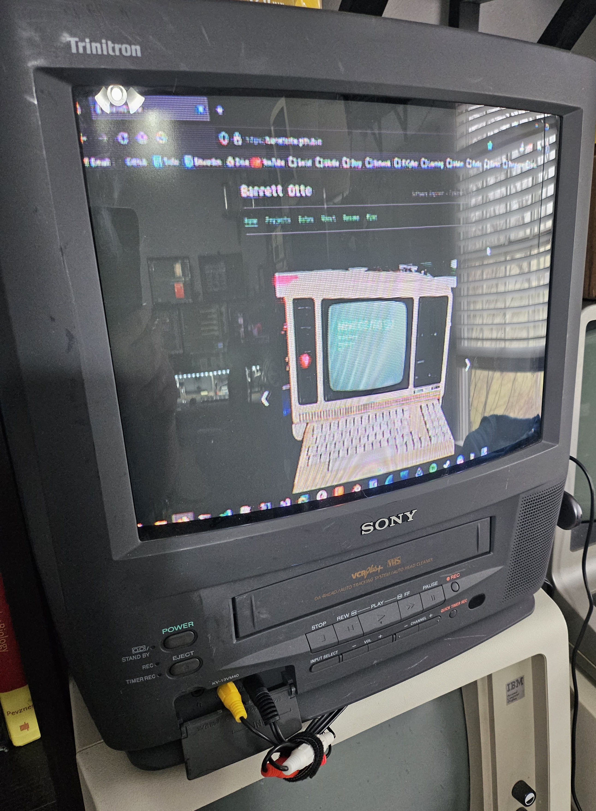
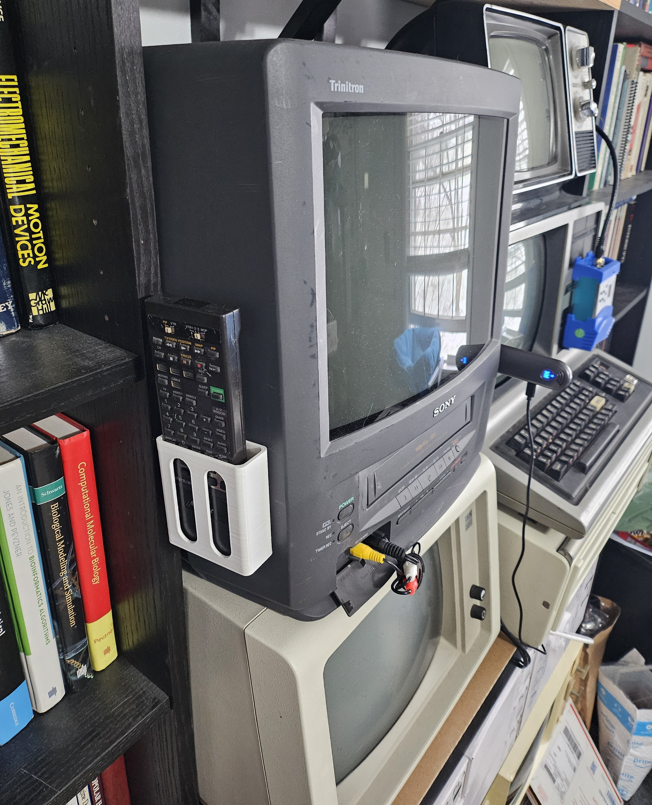

# sony-trinitron

Sony Trinitron stuff.

## External Display 

(2023-12-23)

Setting up a Sony Trinitron as an external display.

- [HMDI to RCA Converter](https://www.amazon.com/gp/product/B08CH91V1W)
- [Wireless HDMI Transmitter and Receiver](https://www.amazon.com/gp/product/B0CKXC7X2R)

Wireless HDMI -> HDMI to RCA

Recommended resolution: 1280x720

## Remote Holder 

(2023-12-26)

Simple remote holder for my Sony Trinitron.

I bought an old Sony remote on eBay and it didn't work.
But, I was able to track it down to a bad solder joint possibly messed up from
a corroded battery. After resoldering, it worked fine.

