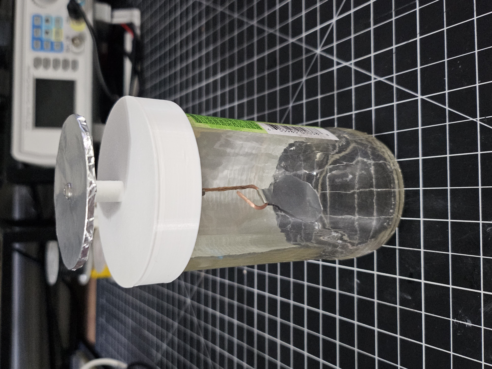
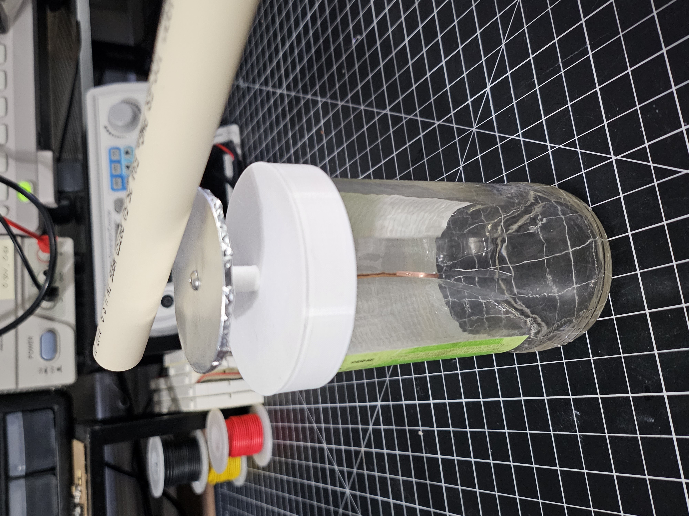

# electroscope

A simple beer bottle electroscope

## Summary

This device is just used to detect an electric charge on an object.

The first form of electroscope was made around 1600, called the Versorium.
The form of electroscope is known as a gold-leaf electroscope, even though I used aluminum foil instead of gold foil.

The leaves of the electroscope move due to electrostatic force and the amount of charge an object has
is proportional to its voltage.

Unfortunately, the electroscope is really primitive and really only gives you a vague idea on if an object is charged
and whether its a small or large amount of charge.
Another device called an [electrometer](https://en.wikipedia.org/wiki/Electrometer) actually provides a quantitative measure of electric charge.

## Images

Electroscope at rest

Electroscope reacting to charged PVC...hard to see in picture due to distortion of beer bottle.

## Parts List

- M3 x 40mm Hex Screw
- M3 nuts (x3)
- M3 washer (x3)
- Aluminum foil for collector and leaves
- 8mm long 1.5mm inner diameter magnet wire - enamel sanded off on both ends
- Beer bottle cut below glass weld point, preferably clear
- 3D printed
  - [bottle-mid.stl](bottle-mid.stl)
  - [collector.stl](collector.stl)

## Misc

- The more surface area the leaves have the more they react
- Used a foot long 1/2" diameter PVC pipe and dish towel to test

## References

- https://en.wikipedia.org/wiki/Electroscope
- https://en.wikipedia.org/wiki/Electrometer
