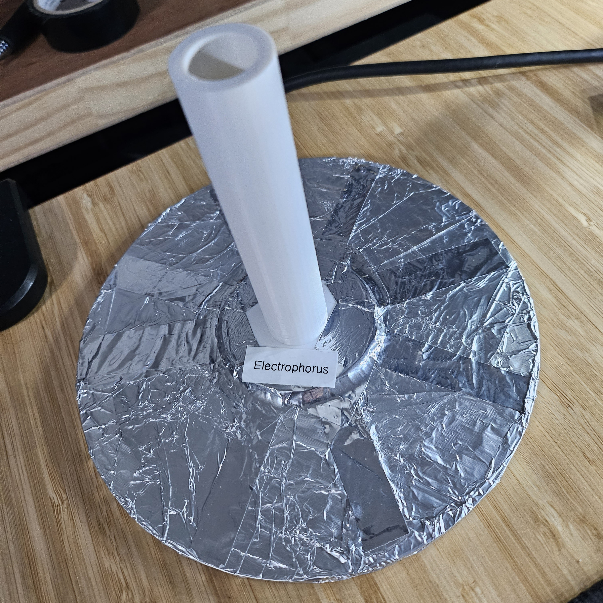

# electrophorus

The simplest electrostatic generator - https://en.wikipedia.org/wiki/Electrophorus

I made this as a sanity check while figuring out how to charge my [leyden jar](../leyden-jar/)
that will be used for my Wimshurst machine.

## Assembly

- cut out ~5" cardboard circle
- taped `electrophorus-handle.stl` to cardboard disk
- wrapped aluminum foil around bottom of cardboard disk, trying to keep it smooth
- taped aluminum foil down on top of cardboard disk

## How To Use

- Rub plastic sheet with silk, fur, towel, or something like that. Electrons transferred from rubbed material to plastic sheet.
- Negative charge of plastic sheet repels electrons in conductor to top of plate. (top = negative, bottom = positive)
- Touch top of plate to provide electrons a path to ground. The positive charge on the bottom of the plate will remain
- Touch bottom of plate to some object to transfer charge
- This process can be repeated to continually transferring charge

## Triboelectricity

TODO:

## References

- https://www.youtube.com/watch?v=Sqhgrw3bDmU
