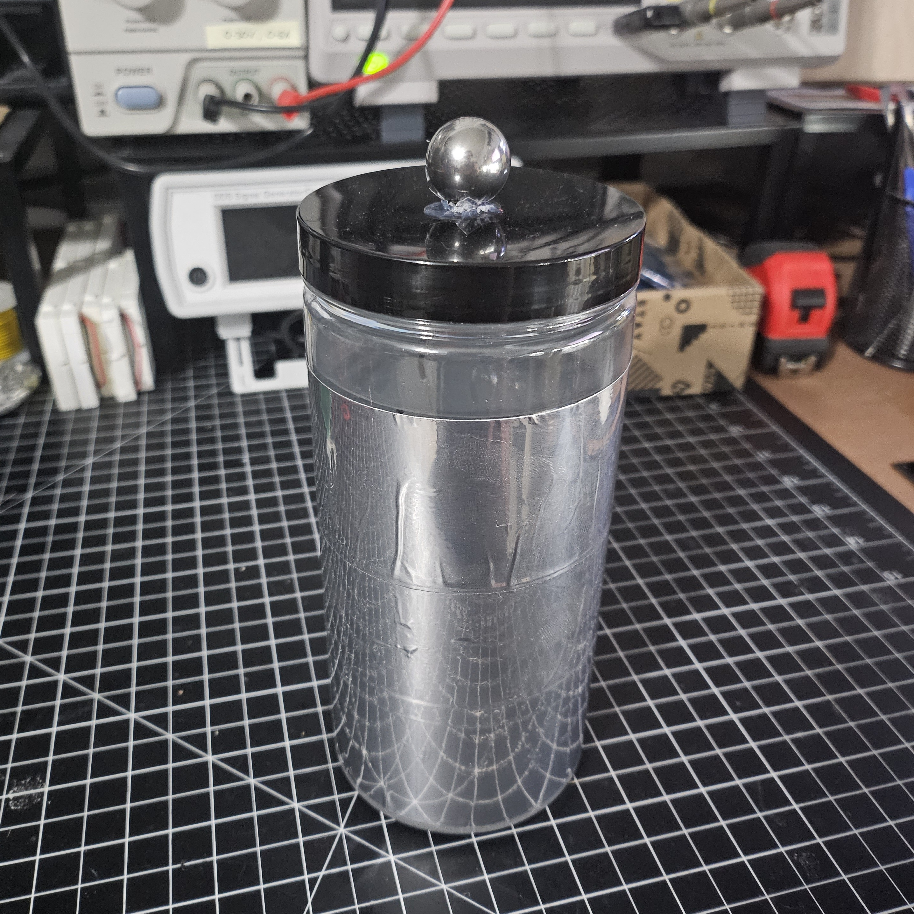
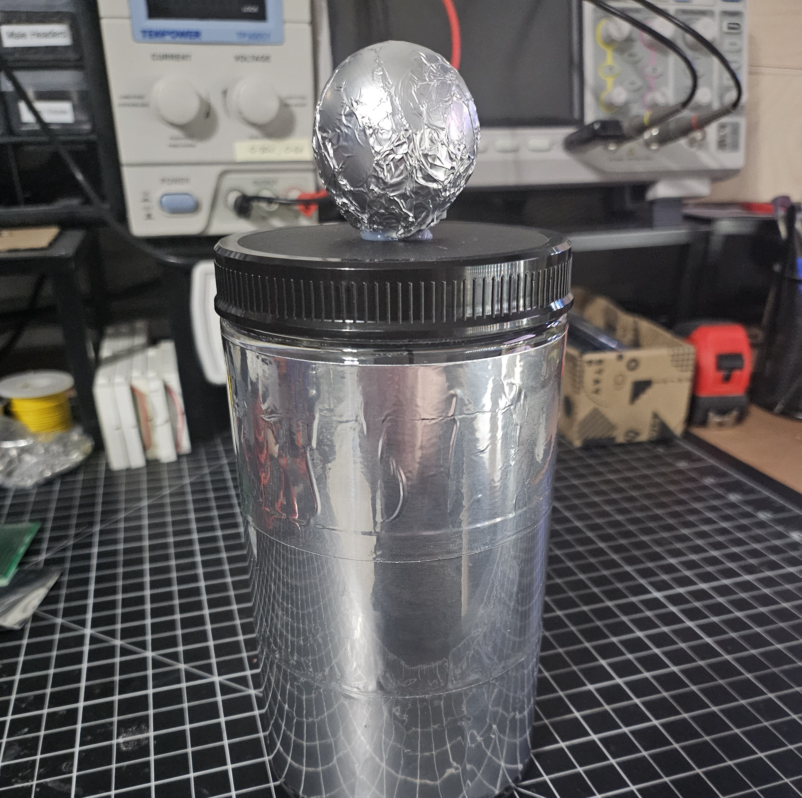

# leyden-jar

The simplest capacitor, discovered around 1745 - https://en.wikipedia.org/wiki/Leyden_jar

## Version 1

- insulator - [32oz plastic jar](https://www.amazon.com/dp/B0919K1LJ5)
- conductors
  - salt water inside (3 tablespoons iodized salt in tap water)
  - aluminum tape outside
- top electrode
  - [30mm ball bearings](https://www.amazon.com/gp/product/B07YKQWVJC)
  - attach length of wire from ball bearing to bottom of inside of the jar

## Version 2

- insulator - [32oz plastic jar (wider mouth)](https://www.amazon.com/dp/B08L2HXXVV)
- conductors
  - aluminum tape inside
  - aluminum tape outside
- top electrode
  - ping pong ball wrapped with alumnium foil
  - attach length of wire from ball bearing to bottom of inside of the jar

## Charging

### Electrophorus

See [../electrophorus/](../electrophorus/)

### PVC Pipe

- Ground left hand to outside of leyden jar using wire
- Hold towel/fur in left hand
- Use right hand to rub PVC pipe, making sure to pass end of PVC over top of leyden jar

### Electric Flyswatter

https://www.amazon.com/dp/B0B8JTFZ19

- Connect one wire to inside grid of swatter to leyden jar electrode
- Connect another wire to outside grid of swatter
- Touch outside grid wire to leyden jar electrode while left hand is touching outside of leyden jar and activating swatter

## References

- https://en.wikipedia.org/wiki/Leyden_jar
- https://www.youtube.com/watch?v=xjW-isgOijs
- https://www.youtube.com/watch?v=HB1zKNTHreU
