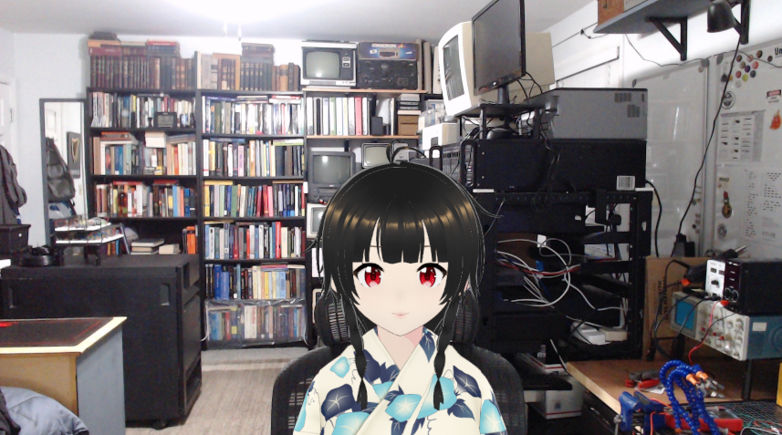

# vtuber

(2024-01-06)

I thought it'd be funny to show up in Discord one day as a vtuber.

## Setup

### VRoid Studio

[VRoid Studio](https://vroid.com/en/studio)

- make model
- save model as `.vroid`
- export model as `.vrm` (top right button)

### VSeeFace

[VSeeFace](https://www.vseeface.icu)

- add `.vrm` file
- select camera, high quality, 30fps
- enable transparency bottom right
- spacebar to hide transparency toggle
- use ALT+Mouse keys to rotate, translate, etc model

### OBS Settings

- game capture
  - Mode: Capture specific window
  - Window: VSeeFace.exe
  - Window Match Priority: Match Title, ...
  - Allow Transparency: Yes
  - Capture Cursor: No
- image -> image of my room

## References

- https://booth.pm/en
- VRoidStudio, VSeeFace, OBS Studio - https://www.youtube.com/watch?v=CYUoFSABRrM
- VSeeFace Full Guide 2023 - https://www.youtube.com/watch?v=-1pP9-uX8Pk
- VMagicMirror - Hand tracking - https://www.youtube.com/watch?v=YfiNvOsDh0g
