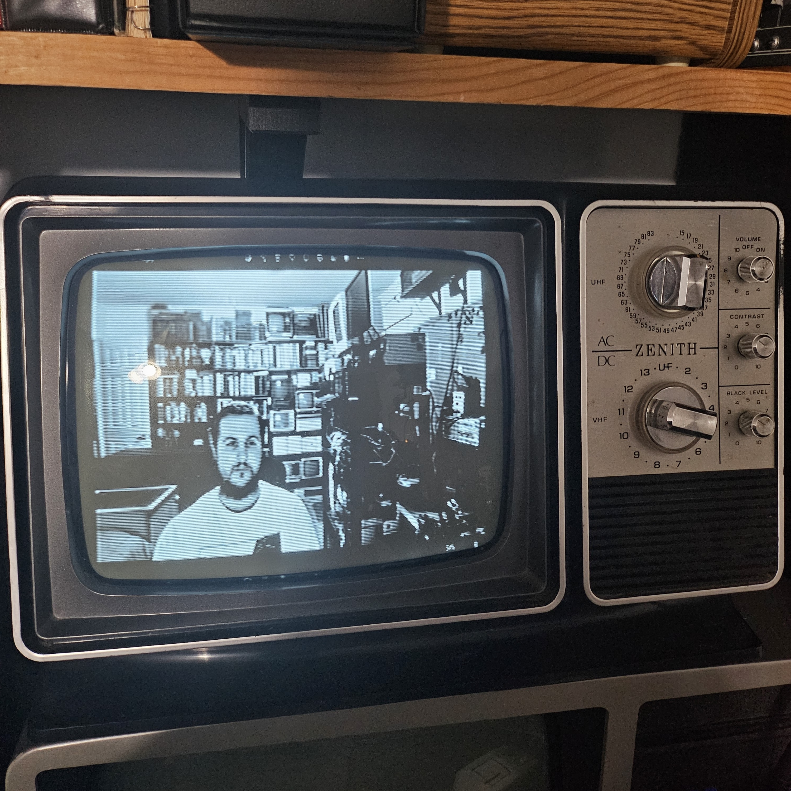

# zenith-1980

1980 Zenith AC/DC black and white TV stuff.

## External Display 

(2023-12-31)

Setting up a 1980s black and white TV as an external display.

- [HDMI RF Modulator](https://www.amazon.com/dp/B0976L5C7B)
- [Wireless HDMI Transmitter and Receiver](https://www.amazon.com/gp/product/B0CKXC7X2R)

Wireless HDMI -> HDMI to RF Modulator

Recommended resolution: 1280x720 @50Hz
